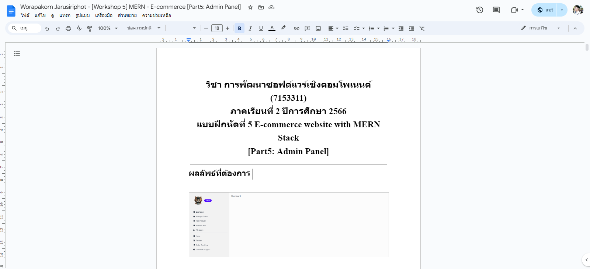

# Worapakorn644259018-MERN-E-Commerce_Frontend
ชื่อ นายวรปกร จารุศิริพจน์ รหัสนักศึกษา644259018 หมู่เรียน64/45 งาน [Workshop 5] MERN - E-commerce [Part5: Admin Panel]

- [ลิงค์เอกสารเวอร์ชั่นใหม่ล่าสุด](https://docs.google.com/document/d/1yqF4gg5DVeGhOUhAbYFJGHRFc5RA0NB-3xonS4PjCCQ/edit?usp=sharing)
- [https://docs.google.com/document/d/1yqF4gg5DVeGhOUhAbYFJGHRFc5RA0NB-3xonS4PjCCQ/edit?usp=sharing](https://docs.google.com/document/d/1yqF4gg5DVeGhOUhAbYFJGHRFc5RA0NB-3xonS4PjCCQ/edit?usp=sharing)

# React + Vite

This template provides a minimal setup to get React working in Vite with HMR and some ESLint rules.

Currently, two official plugins are available:

- [@vitejs/plugin-react](https://github.com/vitejs/vite-plugin-react/blob/main/packages/plugin-react/README.md) uses [Babel](https://babeljs.io/) for Fast Refresh
- [@vitejs/plugin-react-swc](https://github.com/vitejs/vite-plugin-react-swc) uses [SWC](https://swc.rs/) for Fast Refresh
